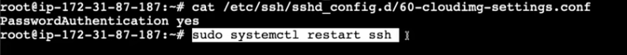

# Remote Access via SSH

**_Remote Linux servers are accessed using the Secure Shell (SSH) protocol._** This involves a client-server architecture:

1.  **Server Side:** A process called `sshd` runs continuously on the Linux server to listen for incoming connections.
2.  **Client Side:** Users employ an SSH client (e.g., Git Bash for Windows, iTerm2 or Terminal for Mac).
3.  **Connection Command:** `ssh <username>@<IP_address>`.

**Authentication Standards**

While password authentication is possible, many cloud providers disable it by default in the `/etc/ssh/sshd_config` file (setting `PasswordAuthentication` to `no`) to prevent credential leaks. In such cases, users must use PEM files or other key-based methods for secure entry.

